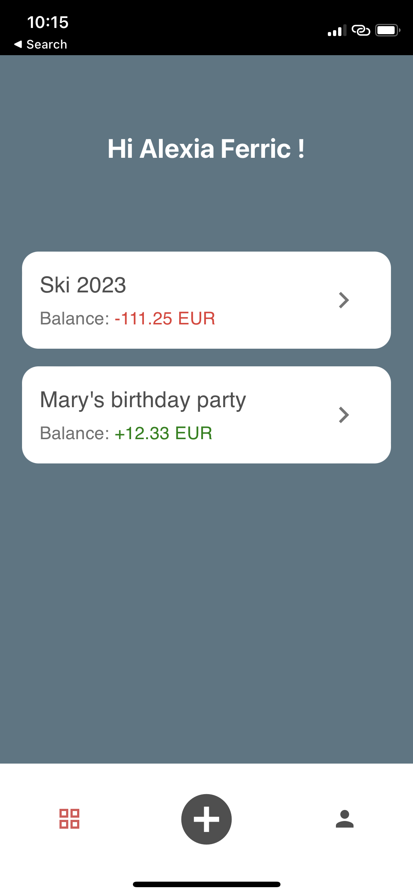
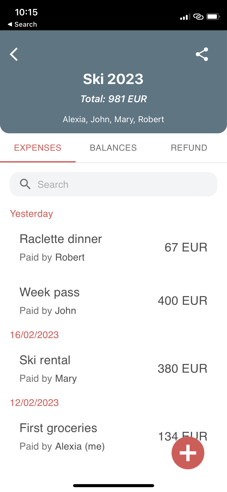
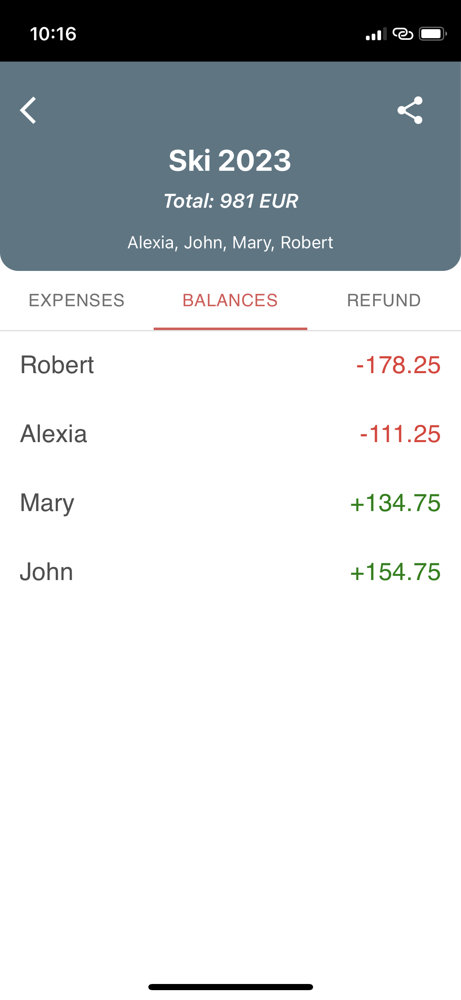
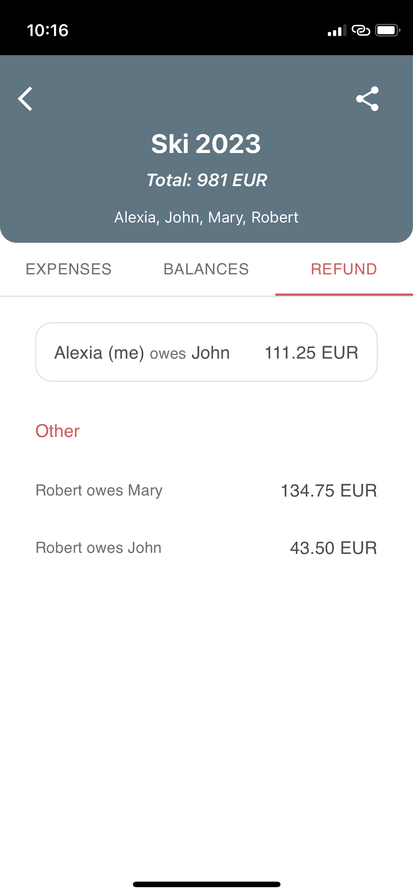

# Sharecount PWA App - Client

<div>




</div>

## Description
Sharecount is the solution for organizing group expenses on the web or mobile.<br>

This is the app's client-side code in Typescript.

[Sharecount App](https://sharecount-client.herokuapp.com/)


## Built With
- [React](https://reactjs.org/) (v18.2.0)
- [Tailwind CSS](https://tailwindcss.com/) (v3.1.8)
- [Material-UI](https://mui.com/) (v5.10.1)


## Installation
```bash
$ npm install
```


## Running the app
```bash
$ npm run dev
```

Open [http://localhost:3000](http://localhost:3000) to view it in the browser.
